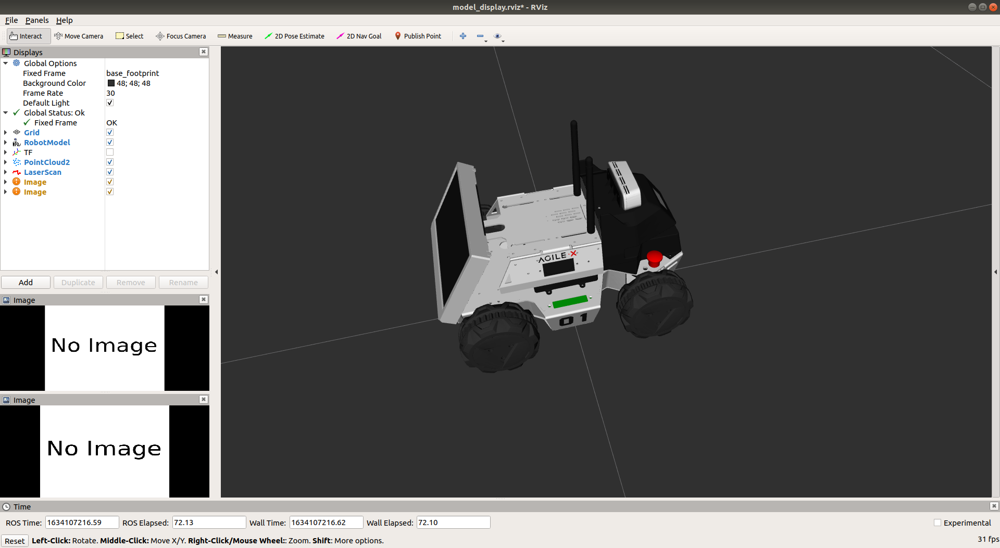
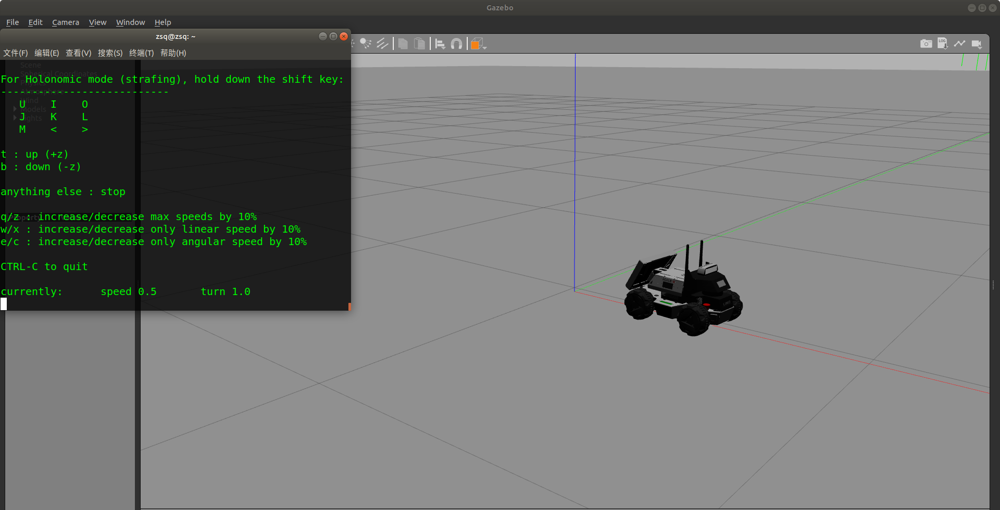

# LIMO环境配置过程

## 1.	功能包介绍

```
├── image
├── limo_description
├── limo_gazebo_sim
```

​	limo_description: 模型描述文件功能包

​	limo_gazebo_sim: gazebo仿真启动功能包

## 2.	使用环境

### Development Environment

​	ubuntu 22.04 + [RO2 humble desktop full](http://docs.ros.org/en/humble/Installation/Ubuntu-Install-Debians.html)

### 需要下载的功能包

​	下载安装gazebo相关的依赖和gazebo-ros-control等功能包；gazebo-ros是gazebo与ROS之间的通信接口，连接ROS与Gazebo

```
sudo apt-get install ros-humble-gazebo-*
```

​	下载并安装 joint-state-publisher-gui joint-state-publisher 。这两个功能包是用于发布关节信息的

```
sudo apt-get install ros-humble-joint-state-publisher ros-humble-joint-state-publisher-gui
```

​	下载并安装diff-drive-controller；diff-drive-controller是用于控制车子的gazebo插件

```
sudo apt-get install ros-humble-diff-drive-controller
```

​	下载并安装control相关的依赖和功能包；control用于定义模型关节的类型

```
sudo apt-get install ros-humble-control-*
```

​	下载并安装键盘控制节点

```
sudo apt-get install ros-humble-teleop-twist-keyboard 
```


## 3.	使用方法

### 1.	创建工作空间并下载代码

​		在终端中创建一个名为agilex_open_class的文件夹:

```
mkdir agilex_open_class
```

​		进入agilex_open_class文件夹

```
cd agilex_open_class
```

​		在创建一个src
```
mkdir src
```

​		进入src

```
cd src
```

​		下载仿真代码

```
git clone https://github.com/agilexrobotics/agilex_open_class.git
```

​		进入agilex_open_class文件夹

```
cd agilex_open_class
```

​		检查一下是否缺少依赖

```
rosdep install -i --from-path src --rosdistro humble -y
```

​	编译代码

```
colcon build
```


### 2.	启动limo 模型并在Rviz中可视化

​	进入agilex_open_class文件

```
cd agilex_open_class
```

​	声明工作空间的环境变量

```
source devel/setup.bash
```

​	声明gazebo的环境变量	

```
source /usr/share/gazebo/setup.bash
```

​	运行指令，在Rviz中可视化模型

```
 ros2 launch limo_description display_limo_diff.launch.py 
```

 

### 3.	启动limo Gazebo仿真

​	进入agilex_open_class文件

```
cd agilex_open_class
```

​	声明工作空间的环境变量

```
source devel/setup.bash
```

​	声明gazebo的环境变量	

```
source /usr/share/gazebo/setup.bash
```

​	启动仿真，使用四轮差速模式

```
ros2 launch limo_gazebo_sim limo_diff_empty_world.launch.py 
```

启动键盘控制节点

```
rosrun teleop_twist_keyboard teleop_twist_keyboard.py 
```

 

 

 
