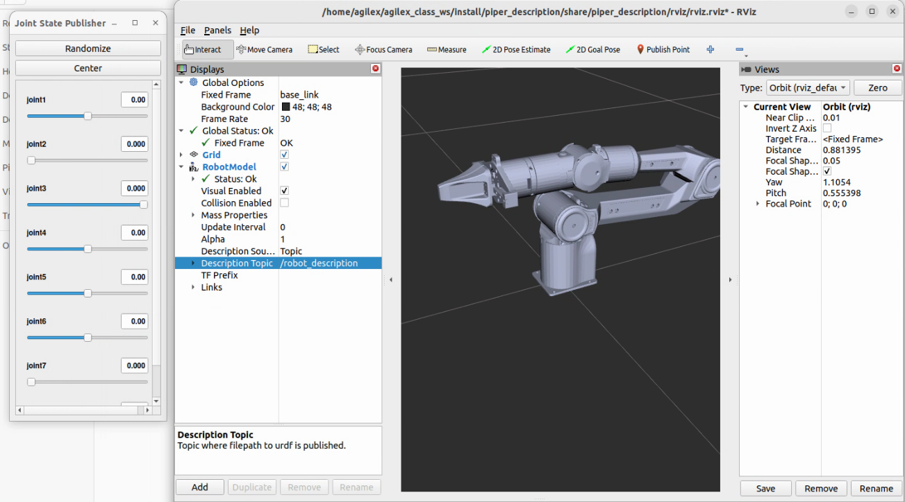
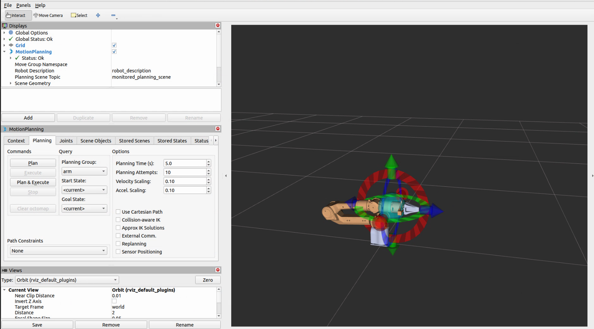
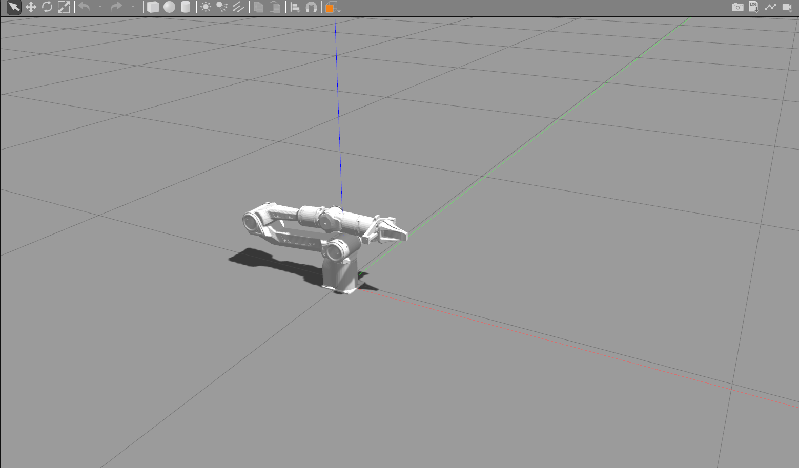
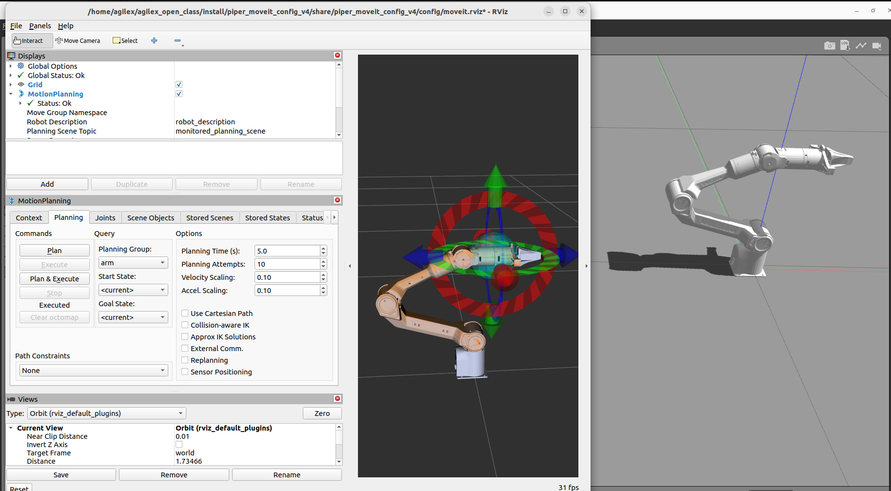

# Moveit2环境配置

## 1、安装Moveit2 

1）二进制安装，[参考链接](https://moveit.ai/install-moveit2/binary/)

```
sudo apt install ros-humble-moveit*
```

2）源码编译方法，[参考链接](https://moveit.ai/install-moveit2/source/)

## 2、使用环境

安装完Moveit2之后，需要安装一些依赖

```
sudo apt-get install ros-humble-control* ros-humble-joint-trajectory-controller ros-humble-joint-state-* ros-humble-gripper-controllers ros-humble-trajectory-msgs
```

## 3、使用方法

1）查看piper机械臂模型

```
ros2 launch piper_description display_piper.launch.py 
```

成功打开之后，需要在Rviz中添加模型，成功添加之后




2）使用moveit2，控制机械臂

```
ros2 launch piper_moveit_config_v5 demo.launch.py
```




## 4、启动Gazebo仿真

1）启动Gazebo仿真

```
ros2 launch piper_description piper_gazebo.launch.py
```



2）使用moveit2，控制机械臂

> 注：有时候会出现moveit控制不了gazebo模型的情况，需要重新启动

```
ros2 launch piper_moveit_config_v4 demo.launch.py
```



